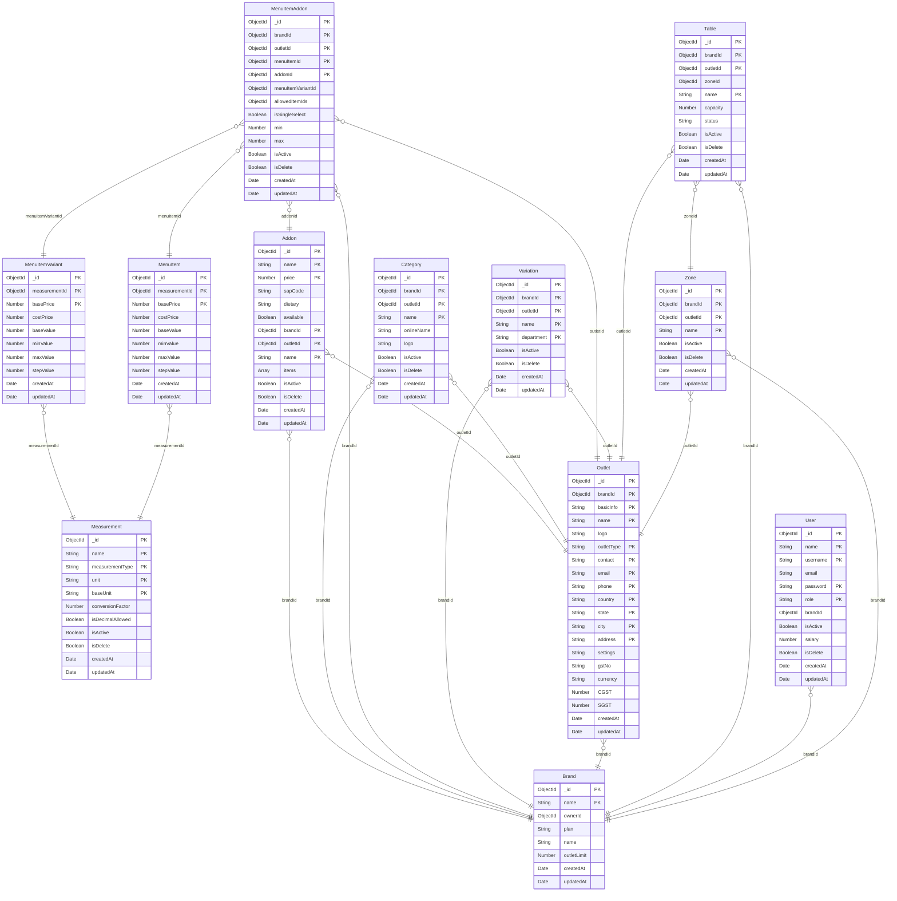

# 🗃️ Database ERD (Entity Relationship Diagram)

> Auto-generated from Mongoose model schemas

---

## 📋 Collections Summary

| Collection | Fields Count | References |
|------------|-------------|------------|
| **Brand** | 8 | - |
| **Measurement** | 11 | - |
| **Addon** | 14 | brandId → Brand, outletId → Outlet |
| **Category** | 10 | brandId → Brand, outletId → Outlet |
| **MenuItemAddon** | 14 | brandId → Brand, outletId → Outlet, menuItemId → MenuItem, addonId → Addon, menuItemVariantId → MenuItemVariant |
| **MenuItemVariant** | 10 | measurementId → Measurement |
| **MenuItem** | 10 | measurementId → Measurement |
| **Variation** | 9 | brandId → Brand, outletId → Outlet |
| **Outlet** | 20 | brandId → Brand |
| **Table** | 11 | brandId → Brand, outletId → Outlet, zoneId → Zone |
| **User** | 12 | brandId → Brand |
| **Zone** | 8 | brandId → Brand, outletId → Outlet |